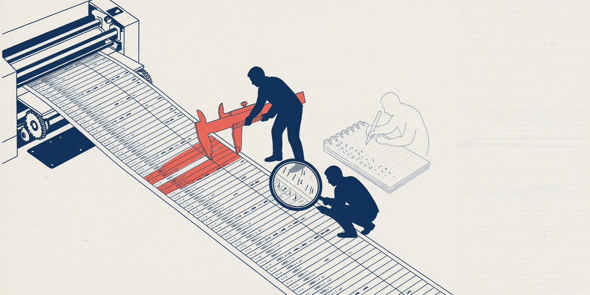
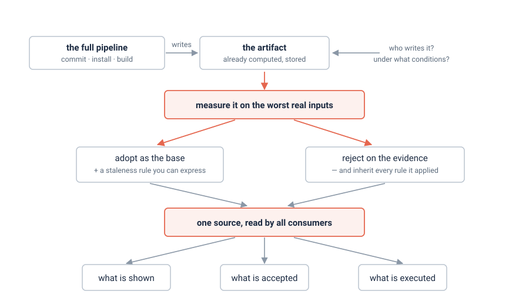

<p align="center">
  
</p>

# evidence-first-design

**Продуманный дизайн — гипотеза. То, что живая система уже посчитала, — доказательство.**
Навык для кодовых агентов, который заставляет исполнителя собрать второе до того, как написан код.
Появился он потому, что сильная модель на той же задаче обошла заранее согласованный дизайн —
именно тем, что отказалась ему верить.

<p>
  <a href="LICENSE"></a>
  
  
  <a href="README.md"></a>
</p>

## Провал, против которого он написан

Агент, которого спросили «какое значение здесь верное», идёт к первичным источникам и выводит его
сам. Его внимание — на коде перед глазами, а перед глазами код, который величину **читает**. При
этом система обычно уже посчитала ту же величину где-то ещё — при фиксации, установке, сборке,
публикации — со всеми применёнными правилами, и сохранила. Ручной вывод воспроизводит эти правила по
одному, и каждое пропущенное становится дефектом.

Провал не в том, что агент этого не знает. В baseline-прогонах он раз за разом **находил** сохранённый
артефакт и откладывал его:

> «Это отдельный пайплайн, вне рамок задачи.»
> «PLAN.md эту тему не поднимает и не просит её решать.»
> «Кандидат на рефакторинг в будущем, вне текущего плана.»

Замечено и записано. Дальше уезжал неполный фикс. Это дисциплинарный провал под давлением уже
принятого дизайна — его навык и должен прерывать.

## Что он требует

<picture>
  <source media="(prefers-color-scheme: dark)" srcset="docs/assets/flow-dark.svg">
  
</picture>

Пять шагов, четыре из них до кода: инвентаризовать уже посчитанное (**и кто это пишет, и когда**),
измерить худшие реальные входы и показать вывод, сформулировать инвариант и попытаться его
фальсифицировать, перебрать пространство состояний и — уже после фикса — пройти второй раз по
собственной работе. Полный текст: [docs/ru/SKILL.md](docs/ru/SKILL.md) ([English](SKILL.md)).

Несущая часть — не «предпочитай сохранённый артефакт», а то, что **решает измерение**. Артефакт можно
отвергнуть — но тогда ты наследуешь каждое правило, которое он применял: выпиши эти правила из кода
его писателя и назови те, которых твоя конструкция не применяет. Именно в этом списке прячется
пропущенное правило. Верный ответ обычно гибрид.

## Работает ли

Измерено, а не заявлено: [tests/results.md](tests/results.md). Две фикстуры из несвязанных доменов,
19 прогонов baseline vs skill, слепая оценка по критериям, зафиксированным до прогонов.

| | baseline | с навыком |
|---|---|---|
| `paylane` — способы оплаты, продиктованный фикс / унаследованный план | 3/5, 2/5 | **5/5, 5/5** |
| `deplock` — разрешение зависимостей, продиктованный фикс (3 повтора) | 5, 5, 6 | 5, 5, 5 |
| `deplock` — унаследованный план (3 повтора) | 6, 5, 5 | 6, 5, 6 |

**Вторую и третью строки читать как нулевой результат.** На `deplock` армы неразличимы: пять
критериев из шести дают 3/3 в каждом арме. Поведения, которых требует навык, во втором домене
появляются — но baseline этой фикстуры их и так производит: ловушка лежит на виду в том самом файле,
который назван в промпте, и её нашли все 15 прогонов. Показанный эффект держится на `paylane`, где
пропущенное правило спрятано за конвейером, которого промпт не называет.

Три критерия из шести пришлось исправить, один — уже после того, как первые числа были
опубликованы: формулировка критерия двигала результат сильнее, чем армы. Правило, добавленное в
навык по ходу этой работы, откачено, когда перепроверка его не подтвердила. Всё это — в файле
результатов.

## Установка

Навык — обычный текст: ни рантайма, ни зависимостей, ни настройки. Склонировать и положить симлинк
туда, где агент ищет навыки:

```bash
git clone https://github.com/genhoi/evidence-first-design.git ~/src/evidence-first-design
mkdir -p ~/.agents/skills ~/.claude/skills
ln -s ~/src/evidence-first-design ~/.agents/skills/evidence-first-design   # Codex, Gemini, grok, kimi
ln -s ~/src/evidence-first-design ~/.claude/skills/evidence-first-design   # Claude Code
```

`~/.agents/skills/` — межрантаймовое место, Claude Code читает `~/.claude/skills/`. Поскольку это
только текст, следовать ему может любая модель — и любой модели его можно отдать словами «прочитай
этот файл и работай по нему» даже там, где загрузчика навыков нет вообще.

## Как проверить самому

```bash
tests/make-fixture-deplock.sh /tmp/efd/deplock
tests/make-fixture-paylane.sh /tmp/efd/paylane
```

Обе фикстуры устроены одинаково, но в разных доменах: одна величина считается в трёх местах, есть
артефакт, уже записанный полным конвейером, есть вырожденные входы, ломающие очевидный дизайн, и
унаследованный `PLAN.md` с правдоподобным, но неполным фиксом. В обеих ни одно из очевидных решений
не верно поодиночке. Сценарии, протокол и критерии: [docs/ru/tests-README.md](docs/ru/tests-README.md).

Правишь навык — прогоняй обе фикстуры baseline vs skill и дописывай числа в `tests/results.md`.
Неизмеренная правка дисциплинарного навыка — это гипотеза.

## Рядом

[external-review](https://github.com/genhoi/external-review) запускает другие семейства моделей как
агентов-рецензентов. Его `--mode plan` ревьюит дизайн до реализации, и разделы 1–4 его plan-промпта
намеренно повторяют этот навык: этот — то, что исполнитель делает сам, бесплатно и всегда; тот —
второе мнение, которое окупается при большом радиусе поражения. Артефакты, которые производит этот
навык, и делают такое ревью предметным, а не вкусовым.

## Лицензия

MIT.
